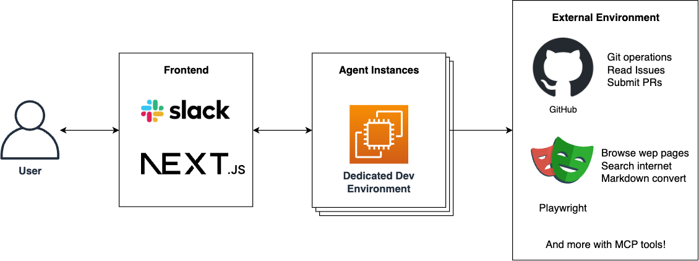
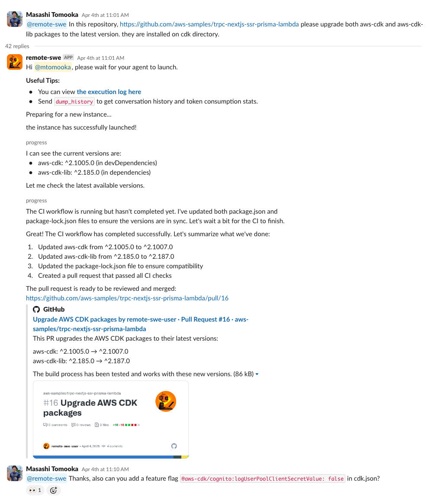

# Remote SWE Agents

This is an example implementation of a fully autonomous software development AI agent. The agent works in its own dedicated development environment, freeing you from being tied to your laptop!



## Key Features

* Fully autonomous software development agent
* Powered by AWS serverless services with minimal maintenance costs
* No upfront or fixed costs while you don't use the system
* MCP integration (tool servers)
* Efficient token usage with prompt cache and middle-out strategy
* Reads knowledge from your preferred formats (.clinerules, CLAUDE.md, etc.)
* Can work on OSS forked repositories!

## Examples 

Some of the agent sessions by Remote SWE agents:

| Example 1 | Example 2 | Example 3 | Example 4 |
|:--------:|:--------:|:--------:|:--------:|
|  |  |  |  |
| Instruct via GitHub issue. [Resulting PR](https://github.com/aws-samples/remote-swe-agents/pull/17) | single instruction to multiple repos [PR#1](https://github.com/aws-samples/trpc-nextjs-ssr-prisma-lambda/pull/16), [PR#2](https://github.com/aws-samples/prisma-lambda-cdk/pull/37), [PR#3](https://github.com/aws-samples/distributed-load-testing-with-locust-on-ecs/pull/25) | The agent can also input and output images as well. | The agent can speak other languages than English as well. [Resulting PR](https://github.com/tmokmss/deploy-time-build/pull/32) |

### Pull Requests Created by the Remote SWE Agents

You can view all the public pull requests created by the agent [here](https://github.com/search?q=is%3Apr+author%3Aremote-swe-user&type=pullrequests). All of the commits pushed from the GitHub user is written by the agent autonomously.

## インストール手順

このプロジェクトは完全にセルフホスト型のため、セットアッププロセスにはSlackアプリの設定など、いくつかの手動操作が必要です。
以下の手順に慎重に従ってください。問題が発生した場合は、GitHubのissueを通じてサポートを提供します！

### 前提条件

- Node.js（バージョン20以上）
- npm（バージョン9以上）
- AWS CLI
- 適切な権限を持つAWS IAMプロファイル
- Docker
- Bedrock Claude Sonnet 3.7モデルが[us-west-2リージョンで有効化](https://docs.aws.amazon.com/bedrock/latest/userguide/getting-started.html#getting-started-model-access)されていること
- Slackワークスペース
- GitHubアカウント

### 1. リポジトリのクローン

```bash
git clone https://github.com/aws-samples/remote-swe-agents.git
cd remote-swe-agents
```

この手順を完了したら、ステップ2に進んで必要なパラメータを設定し、CDKスタックをデプロイします。

### 2. CDKのデプロイ

cdk deployを実行する前に、後で実際の値が入力されるプレースホルダーのSSMパラメータを作成する必要があります：

```bash
aws ssm put-parameter \
    --name /remote-swe/slack/bot-token \
    --value "placeholder" \
    --type String

aws ssm put-parameter \
    --name /remote-swe/slack/signing-secret \
    --value "placeholder" \
    --type String

aws ssm put-parameter \
    --name /remote-swe/github/personal-access-token \
    --value "placeholder" \
    --type String
```

その後、cdk deployを実行できます。上記のパラメータ名は`bin/cdk.ts`で参照されています。

```bash
cd cdk && npm ci
npx cdk bootstrap
npx cdk deploy
```

デプロイには通常約5分かかります。デプロイ後、Slack Boltアプリのエンドポイントが表示されます。次のステップで必要になるため、CDK出力の`SlackBoltEndpointUrl`をメモしておいてください。

この手順を完了したら、ステップ3に進んでSlackアプリケーションを設定します。

### 3. Slackアプリのセットアップ

ここでは、Slackインターフェースを通じてエージェントを制御するためのSlackアプリを設定する必要があります。

#### Slackアプリの作成

1. [Slack APIダッシュボード](https://api.slack.com/apps)にアクセス
2. 「Create New App」（新しいアプリを作成）をクリック
3. 「From manifest」（マニフェストから）を選択
4. 提供されているSlackアプリのマニフェストYAMLファイルを使用：[manifest.json](./resources/slack-app-manifest.json)
   - エンドポイントURL（`https://redacted.execute-api.us-east-1.amazonaws.com`）を実際のURLに置き換えてください
   - 実際のURLはCDKデプロイメント出力の`SlackBoltEndpointUrl`で確認できます
5. 以下の値を必ずメモしておいてください：
   - 署名シークレット（Basic Informationで確認可能）
   - ボットトークン（OAuth & Permissions内、ワークスペースにインストール後に確認可能）

詳細については、こちらのドキュメントを参照してください：[マニフェストでアプリを作成および設定する](https://api.slack.com/reference/manifests)

> [!NOTE]
> 共有（個人ではなく）Slackワークスペースを使用している場合は、エージェントへのアクセスを制御するために`ADMIN_USER_ID_LIST`環境変数（以下を参照）の設定を検討してください。この制限がないと、ワークスペース内の誰でもエージェントにアクセスでき、潜在的にあなたのGitHubコンテンツにもアクセスできてしまいます。


#### SlackシークレットのSSMパラメータ作成

Slackアプリを作成した後、以下のコマンドでAWSアカウントにシークレットを登録します：

```bash
aws ssm put-parameter \
    --name /remote-swe/slack/bot-token \
    --value "your-slack-bot-token" \
    --type String \
    --overwrite

aws ssm put-parameter \
    --name /remote-swe/slack/signing-secret \
    --value "your-slack-signing-secret" \
    --type String \
    --overwrite
```

`your-slack-bot-token`と`your-slack-signing-secret`を、前のステップで取得した実際の値に置き換えてください。これらのパラメータはCDKから参照されます。

この手順を完了したら、ステップ4に進んでGitHub連携を設定します。認証にはPersonal Access Token（PAT）またはGitHub Appのいずれかを選択する必要があります。


### 4. GitHub連携

GitHubと連携するには、GitHub連携のセットアップが必要です。GitHub連携には2つの選択肢があります：

**どちらのオプションを選ぶべきか？**
- **Personal Access Token（オプション1）**：個人利用や迅速なセットアップに適しています。より単純ですが、単一のユーザーアカウントに紐づけられます。
- **GitHub App（オプション2）**：チーム環境や組織での利用に推奨されます。より詳細な権限を提供し、個人アカウントに紐づけられません。

#### オプション1：Personal Access Token (PAT)

1. [GitHub設定 > 開発者設定 > 個人アクセストークン](https://github.com/settings/tokens)にアクセス
2. 適切なリポジトリアクセス権を持つ新しいトークン（クラシック）を生成
   * 必要なスコープ：`repo, workflow, read:org`
   * 許可するスコープが多いほど、エージェントがさまざまなタスクを実行できるようになります
3. 生成したトークン文字列でSSMパラメータを作成
   ```bash
   aws ssm put-parameter \
      --name /remote-swe/github/personal-access-token \
      --value "your-access-token" \
      --type String \
      --overwrite
   ```

> [!NOTE]
> システムを複数の開発者と共有したい場合、個人の権限の悪用を防ぐために、自分のアカウントのPATを使用するのではなく、[GitHubのマシンユーザーアカウント](https://docs.github.com/en/get-started/learning-about-github/types-of-github-accounts#user-accounts)を作成することをお勧めします。

#### オプション2：GitHub App

1. [GitHub設定 > 開発者設定 > GitHub Apps](https://github.com/settings/apps)にアクセス
2. 新しいGitHub Appを作成
3. 権限を設定し、秘密鍵を生成
   - 必要な権限：Actions(RW)、Issues(RW)、Pull requests(RW)、Contents(RW)
4. 秘密鍵用の[AWS Systems Manager パラメータストア](https://console.aws.amazon.com/systems-manager/parameters)のパラメータを作成
   - このパラメータはCDKから参照されます（デフォルトのパラメータ名：`/remote-swe/github/app-private-key`）
5. 使用したいGitHub組織にアプリをインストール
   - アプリをインストールした後、URL（`https://github.com/organizations/<YOUR_ORG>/settings/installations/<INSTALLATION_ID>`）からインストールIDを確認できます
6. 以下の値をメモしておいてください：
   - アプリID（例：12345678）
   - インストールID（例：12345678）
   - AWS Systems Manager パラメータストア内の秘密鍵パラメータ名

> [!NOTE]
> 現在、GitHub Appを使用する場合、単一の組織（つまり、アプリのインストール）の下のリポジトリのみを使用できます。

この手順を完了したら、ステップ5に進んで選択したGitHub連携方法に基づいて環境変数を設定します。

### 5. 環境変数のセットアップ

デプロイメントには以下の環境変数が必要です：

#### GitHub App連携の場合：

GitHub App連携（上記のオプション2）を使用する場合、CDKをデプロイする際に以下の2つの環境変数を設定する必要があります。

```sh
export GITHUB_APP_ID=your-github-app-id
export GITHUB_INSTALLATION_ID=your-github-installation-id
```

> [!NOTE]
> ここでは、GitHub Actions変数から設定を注入するために環境変数を使用しています。これが便利でない場合は、[`bin/cdk.ts`](cdk/bin/cdk.ts)内の値を直接ハードコードすることもできます。

#### （オプション）Slackからのシステムアクセス制限

Slackワークスペース内のどのメンバーがエージェントにアクセスできるかを制御するには、以下の環境変数でSlackユーザーIDのカンマ区切りリストを提供できます：

メンバーのSlackユーザーIDを取得するには、[これらの指示](https://www.google.com/search?q=copy+member+id+slack)に従ってください。

```sh
export ADMIN_USER_ID_LIST=U123ABC456,U789XYZ012
```

指定されたユーザーID以外のすべてのユーザーは、Slackアプリへのアクセスを試みると「Unauthorized」エラーを受け取ります。

> [!NOTE]
> ユーザーにアプリへのアクセス権を付与するには、`approve_user`メッセージとユーザーのメンションをアプリでメンションします。例：`@remote-swe approve_user @Alice @Bob @Carol`

この手順を完了したら、ステップ6に進んで設定でデプロイメントを完了します。

### 6. 設定変数を使用してCDKを再度デプロイ

上記のセットアップが完了したら、`cdk deploy`を再度実行します。

```bash
cd cdk
npx cdk deploy
```

おめでとうございます！セットアップは完了しました。これでSlackからすべての機能にアクセスできます。Slackアプリをメンションするだけで、エージェントにタスクを割り当て始めることができます！

エージェントを効果的に使用するためのヒントについては、以下の「有用なヒント」セクションを参照してください。

## Useful Tips

### Prompting Best Practices

When you start an agent, your instruction should include at least the below content:

1. Which GitHub repository should they see
2. Describe the feature or bug you want to solve
3. What file should they check first (file path would be the best, but only keywords can also work)

To simplify the workflow, you can create a GitHub issue in the repository containing the information above, and just give the agent its URL.
This way the repository is automatically inferred from the URL, and it can also link the new PR to the corresponding issue.

### Integrating with MCP Servers

As our agent can work as an MCP client, you can easily integrate it with various MCP servers. To configure the integration, you can edit [`claude_desktop_config.json`](./worker/claude_desktop_config.json) and run CDK deploy. For example,

```json
  "mcpServers": {
    "awslabs.cdk-mcp-server": {
      "command": "uvx",
      "args": ["awslabs.cdk-mcp-server@latest"],
      "env": {
        "FASTMCP_LOG_LEVEL": "ERROR"
      }
    }
  }
```

All the new agents can now use MCP servers as their tools.

### Overriding the Foundation Model

By default the Remote SWE uses Claude Sonnet 3.7 as the foundation model. You can override this configuration by the below steps:

1. Edit [cdk/lib/constructs/worker/index.ts](./cdk/lib/constructs/worker/index.ts) to set the environment variable `MODEL_OVERRIDE` for the worker service. The available values are: `sonnet3.5v1, sonnet3.5, sonnet3.7, haiku3.5, and nova-pro`
   ```diff
   Environment=BEDROCK_AWS_ROLE_NAME=${props.loadBalancing?.roleName ?? ''}
   + Environment=MODEL_OVERRIDE=nova-pro

   [Install]
   ```
2. Run cdk deploy
3. New workers now use the override model.

Note that this feature is highly experimental and we generally recommend to use the default model for optimized experience.

## How it works

This system utilizes a Slack Bolt application to manage user interactions and implement a scalable worker system. Here's the main workflow:

1. **Message Reception and Processing**
   - When a user sends a message in Slack, it's forwarded to the Slack Bolt application via webhook
   - API Gateway receives the webhook request and passes it to a Lambda function

2. **Event Management and Message Distribution**
   - The Lambda function publishes user messages to AppSync Events
   - Message history is stored in DynamoDB for reference in subsequent processing

3. **Worker System Management**
   - When a new Slack thread is created, the Worker Manager is notified
   - The Worker Manager provisions a Worker Unit consisting of an EC2 instance and EBS volume
   - Each Worker Unit contains an SWE agent responsible for the actual processing

4. **Feedback Loop**
   - Worker Units subscribe to AppSync Events to receive user messages
   - Processing results and progress updates are sent back to Slack as replies to the user
   - Job statuses are managed in DynamoDB

This architecture enables a scalable and reliable messaging processing system. The combination of serverless components (Lambda, API Gateway) and dedicated EC2 instances per worker ensures resource isolation and flexible scalability.


## Cost

The following table provides a sample cost breakdown for deploying this system in the us-east-1 (N. Virginia) region for one month.

Here we assume you request 100 sessions per month. The monthly cost is proportional to the number of sessions. (e.g. If you only run 20 session/month, multiply it with 20/100.)

| AWS service | Dimensions | Cost [USD/month] |
|-------------|------------|------------------|
| EC2 | t3.large, 1 hour/session | 8.32 |
| EBS | 50 GB/instance, 1 day/instance | 13.33 |
| DynamoDB | Read: 1000 RRU/session | 0.0125 |
| DynamoDB | Write: 200 WRU/session | 0.0125 |
| DynamoDB | Storage: 2 MB/session | 0.05 |
| AppSync Events | Requests: 20 events/session | 0.002 |
| AppSync Events | Connection: 1 hour/session | 0.00048 |
| Lambda | Requests: 30 invocations/session | 0.0006 |
| Lambda | Duration: 128MB, 1s/invocation | 0.00017 |
| API Gateway | Requests: 20 requests/session | 0.002 |
| Bedrock | Input (cache write): Sonnet 3.7 100k tokens/session | 37.5 |
| Bedrock | Input (cache read): Sonnet 3.7 1M tokens/session | 30.00 |
| Bedrock | Output: Sonnet 3.7 20k tokens/session | 30.00 |
| TOTAL | | 120 |

Additionally, when the system is not in use (i.e., no messages are sent to the agents), the ongoing costs are minimal (~0 USD).

## Clean up
You can clean up all the resources you created by the following commands:

```sh
npx cdk destroy --force
```

## Security

See [CONTRIBUTING](CONTRIBUTING.md#security-issue-notifications) for more information.

## License

This library is licensed under the MIT-0 License. See the LICENSE file.
