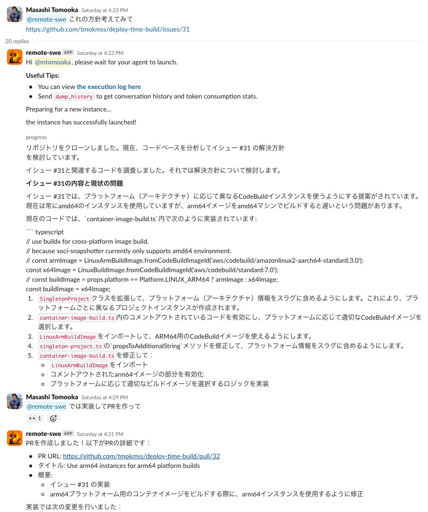

# Remote SWE Agents

これは完全に自律型のソフトウェア開発AIエージェントの実装例です。エージェントは専用の開発環境で動作するため、ノートパソコンに縛られることなく作業ができます！


## 主な特徴

* 完全自律型のソフトウェア開発エージェント
* AWS サーバーレスサービスによる最小限のメンテナンスコスト
* システムを使用しない間は前払いや固定費用なし
* MCP 統合（ツールサーバー）
* プロンプトキャッシュとミドルアウト戦略による効率的なトークン使用
* お好みの形式（.clinerules、CLAUDE.md など）から知識を読み込み
* OSS フォークリポジトリでも動作可能！

## 例

Remote SWE エージェントによるセッション例：

| 例1 | 例2 | 例3 | 例4 |
|:--------:|:--------:|:--------:|:--------:|
|  |  |  |  |
| GitHub issueによる指示。[結果のPR](https://github.com/aws-samples/remote-swe-agents/pull/17) | 単一の指示で複数のリポジトリに対応 [PR#1](https://github.com/aws-samples/trpc-nextjs-ssr-prisma-lambda/pull/16)、[PR#2](https://github.com/aws-samples/prisma-lambda-cdk/pull/37)、[PR#3](https://github.com/aws-samples/distributed-load-testing-with-locust-on-ecs/pull/25) | エージェントは画像の入出力も可能。 | エージェントは英語以外の言語も話せます。[結果のPR](https://github.com/tmokmss/deploy-time-build/pull/32) |

### Remote SWE Agentsによって作成されたプルリクエスト

エージェントによって作成された公開プルリクエストはすべて[こちら](https://github.com/search?q=is%3Apr+author%3Aremote-swe-user&type=pullrequests)で確認できます。GitHubユーザーからプッシュされたすべてのコミットは、エージェントによって自律的に作成されています。

## インストール手順

このプロジェクトは完全にセルフホスト型のため、セットアッププロセスにはSlackアプリの設定など、いくつかの手動操作が必要です。
以下の手順に慎重に従ってください。問題が発生した場合は、GitHubのissueを通じてサポートを提供します！

### 前提条件

- Node.js（バージョン20以上）
- npm（バージョン9以上）
- AWS CLI
- 適切な権限を持つAWS IAMプロファイル
- Docker
- Bedrock Claude Sonnet 3.7モデルが[us-west-2リージョンで有効化](https://docs.aws.amazon.com/bedrock/latest/userguide/getting-started.html#getting-started-model-access)されていること
- Slackワークスペース
- GitHubアカウント

### 1. リポジトリのクローン

```bash
git clone https://github.com/aws-samples/remote-swe-agents.git
cd remote-swe-agents
```

この手順を完了したら、ステップ2に進んで必要なパラメータを設定し、CDKスタックをデプロイします。

### 2. CDKのデプロイ

cdk deployを実行する前に、後で実際の値が入力されるプレースホルダーのSSMパラメータを作成する必要があります：

```bash
aws ssm put-parameter \
    --name /remote-swe/slack/bot-token \
    --value "placeholder" \
    --type String

aws ssm put-parameter \
    --name /remote-swe/slack/signing-secret \
    --value "placeholder" \
    --type String

aws ssm put-parameter \
    --name /remote-swe/github/personal-access-token \
    --value "placeholder" \
    --type String
```

その後、cdk deployを実行できます。上記のパラメータ名は`bin/cdk.ts`で参照されています。

```bash
cd cdk && npm ci
npx cdk bootstrap
npx cdk deploy --all
```

デプロイには通常約5分かかります。デプロイ後、Slack Boltアプリのエンドポイントが表示されます。次のステップで必要になるため、CDK出力の`SlackBoltEndpointUrl`をメモしておいてください。

この手順を完了したら、ステップ3に進んでSlackアプリケーションを設定します。

### 3. Slackアプリのセットアップ

ここでは、Slackインターフェースを通じてエージェントを制御するためのSlackアプリを設定する必要があります。

#### Slackアプリの作成

1. [Slack Appsダッシュボード](https://api.slack.com/apps)にアクセス
2. 「Create New App」（新しいアプリを作成）をクリック
3. 「From manifest」（マニフェストから）を選択
4. 提供されているSlackアプリのマニフェストYAMLファイルを使用：[manifest.json](./resources/slack-app-manifest.json)
   - Slackワークスペース管理者がより広い権限をボットに付与することを許可している場合は、[slack-app-manifest-relaxed.json](./resources/slack-app-manifest-relaxed.json)も利用できます。これを使うと、botにメンションをしなくても、Slackスレッド内でエージェントと会話することができます。
   - エンドポイントURL（`https://redacted.execute-api.us-east-1.amazonaws.com`）を実際のURLに置き換えてください
   - 実際のURLはCDKデプロイメント出力の`SlackBoltEndpointUrl`で確認できます
5. 以下の値を必ずメモしておいてください：
   - 署名シークレット（Basic Informationで確認可能）
   - ボットトークン（OAuth & Permissions内、ワークスペースにインストール後に確認可能）

詳細については、こちらのドキュメントを参照してください：[マニフェストでアプリを作成および設定する](https://api.slack.com/reference/manifests)

> [!NOTE]
> 共有（個人ではなく）Slackワークスペースを使用している場合は、エージェントへのアクセスを制御するために`ADMIN_USER_ID_LIST`環境変数（以下を参照）の設定を検討してください。この制限がないと、ワークスペース内の誰でもエージェントにアクセスでき、潜在的にあなたのGitHubコンテンツにもアクセスできてしまいます。


#### SlackシークレットのSSMパラメータ作成

Slackアプリを作成した後、以下のコマンドでAWSアカウントにシークレットを登録します：

```bash
aws ssm put-parameter \
    --name /remote-swe/slack/bot-token \
    --value "your-slack-bot-token" \
    --type String \
    --overwrite

aws ssm put-parameter \
    --name /remote-swe/slack/signing-secret \
    --value "your-slack-signing-secret" \
    --type String \
    --overwrite
```

`your-slack-bot-token`と`your-slack-signing-secret`を、前のステップで取得した実際の値に置き換えてください。これらのパラメータはCDKから参照されます。

この手順を完了したら、ステップ4に進んでGitHub連携を設定します。認証にはPersonal Access Token（PAT）またはGitHub Appのいずれかを選択する必要があります。


### 4. GitHub連携

GitHubと連携するには、GitHub連携のセットアップが必要です。GitHub連携には2つの選択肢があります：

**どちらのオプションを選ぶべきか？**
- **Personal Access Token（オプション1）**：個人利用や迅速なセットアップに適しています。より単純ですが、単一のユーザーアカウントに紐づけられます。
- **GitHub App（オプション2）**：チーム環境や組織での利用に推奨されます。より詳細な権限を提供し、個人アカウントに紐づけられません。

#### オプション1：Personal Access Token (PAT)

1. [GitHub設定 > 開発者設定 > 個人アクセストークン](https://github.com/settings/tokens)にアクセス
2. 適切なリポジトリアクセス権を持つ新しいトークン（クラシック）を生成
   * 必要なスコープ：`repo, workflow, read:org`
   * 許可するスコープが多いほど、エージェントがさまざまなタスクを実行できるようになります
3. 生成したトークン文字列でSSMパラメータを作成
   ```bash
   aws ssm put-parameter \
      --name /remote-swe/github/personal-access-token \
      --value "your-access-token" \
      --type String \
      --overwrite
   ```

> [!NOTE]
> システムを複数の開発者と共有したい場合、個人の権限の悪用を防ぐために、自分のアカウントのPATを使用するのではなく、[GitHubのマシンユーザーアカウント](https://docs.github.com/en/get-started/learning-about-github/types-of-github-accounts#user-accounts)を作成することをお勧めします。

#### オプション2：GitHub App

1. [GitHub設定 > 開発者設定 > GitHub Apps](https://github.com/settings/apps)にアクセス
2. 新しいGitHub Appを作成
3. 権限を設定し、秘密鍵を生成
   - 必要な権限：Actions(RW)、Issues(RW)、Pull requests(RW)、Contents(RW)
4. 秘密鍵用の[AWS Systems Manager パラメータストア](https://console.aws.amazon.com/systems-manager/parameters)のパラメータを作成
   - このパラメータはCDKから参照されます（デフォルトのパラメータ名：`/remote-swe/github/app-private-key`）
5. 使用したいGitHub組織にアプリをインストール
   - アプリをインストールした後、URL（`https://github.com/organizations/<YOUR_ORG>/settings/installations/<INSTALLATION_ID>`）からインストールIDを確認できます
6. 以下の値をメモしておいてください：
   - アプリID（例：12345678）
   - インストールID（例：12345678）
   - AWS Systems Manager パラメータストア内の秘密鍵パラメータ名

> [!NOTE]
> 現在、GitHub Appを使用する場合、単一の組織（つまり、アプリのインストール）の下のリポジトリのみを使用できます。

この手順を完了したら、ステップ5に進んで選択したGitHub連携方法に基づいて環境変数を設定します。

### 5. 環境変数のセットアップ

デプロイメントには以下の環境変数が必要です：

#### GitHub App連携の場合：

GitHub App連携（上記のオプション2）を使用する場合、CDKをデプロイする際に以下の2つの環境変数を設定する必要があります。

```sh
export GITHUB_APP_ID=your-github-app-id
export GITHUB_INSTALLATION_ID=your-github-installation-id
```

> [!NOTE]
> ここでは、GitHub Actions変数から設定を注入するために環境変数を使用しています。これが便利でない場合は、[`bin/cdk.ts`](cdk/bin/cdk.ts)内の値を直接ハードコードすることもできます。

#### （オプション）Slackからのシステムアクセス制限

Slackワークスペース内のどのメンバーがエージェントにアクセスできるかを制御するには、以下の環境変数でSlackユーザーIDのカンマ区切りリストを提供できます：

メンバーのSlackユーザーIDを取得するには、[これらの指示](https://www.google.com/search?q=copy+member+id+slack)に従ってください。

```sh
export ADMIN_USER_ID_LIST=U123ABC456,U789XYZ012
```

指定されたユーザーID以外のすべてのユーザーは、Slackアプリへのアクセスを試みると「Unauthorized」エラーを受け取ります。

> [!NOTE]
> ユーザーにアプリへのアクセス権を付与するには、`approve_user`メッセージとユーザーのメンションをアプリでメンションします。例：`@remote-swe approve_user @Alice @Bob @Carol`

この手順を完了したら、ステップ6に進んで設定でデプロイメントを完了します。

### 6. 設定変数を使用してCDKを再度デプロイ

上記のセットアップが完了したら、`cdk deploy`を再度実行します。

```bash
cd cdk
npx cdk deploy
```

おめでとうございます！セットアップは完了しました。これでSlackからすべての機能にアクセスできます。Slackアプリをメンションするだけで、エージェントにタスクを割り当て始めることができます！

エージェントを効果的に使用するためのヒントについては、以下の「有用なヒント」セクションを参照してください。

## 有用なヒント

### プロンプトのベストプラクティス

エージェントを起動するとき、指示には少なくとも以下の内容を含めるべきです：

1. エージェントが見るべきGitHubリポジトリ
2. 解決したい機能またはバグの説明
3. 最初にチェックすべきファイル（ファイルパスが最適ですが、キーワードのみでも機能します）

ワークフローを簡素化するために、上記の情報を含むGitHub issueをリポジトリに作成し、エージェントにそのURLを渡すことができます。
この方法では、リポジトリはURLから自動的に推測され、新しいPRを対応するissueにリンクすることもできます。

### MCPサーバーとの統合

エージェントはMCPクライアントとして機能できるため、さまざまなMCPサーバーと簡単に統合できます。統合を設定するには、[`mcp.json`](./packages/worker/mcp.json)を編集してCDK deployを実行します。例えば、

```json
  "mcpServers": {
    "awslabs.cdk-mcp-server": {
      "command": "uvx",
      "args": ["awslabs.cdk-mcp-server@latest"],
      "env": {
        "FASTMCP_LOG_LEVEL": "ERROR"
      }
    }
  }
```

これにより、すべての新しいエージェントがMCPサーバーをツールとして使用できるようになります。

### 基盤モデルのオーバーライド

デフォルトでは、Remote SWEは基盤モデルとしてClaude Sonnet 3.7を使用しています。以下の手順でこの設定をオーバーライドできます：

1. [cdk/lib/constructs/worker/index.ts](./cdk/lib/constructs/worker/index.ts)を編集してワーカーサービスの環境変数`MODEL_OVERRIDE`を設定します。利用可能な値は：`sonnet3.5v1, sonnet3.5, sonnet3.7, haiku3.5, nova-pro`です。
   ```diff
   Environment=BEDROCK_AWS_ROLE_NAME=${props.loadBalancing?.roleName ?? ''}
   + Environment=MODEL_OVERRIDE=nova-pro

   [Install]
   ```
2. cdk deployを実行
3. これで新しいワーカーがオーバーライドモデルを使用します。

この機能は非常に実験的であり、最適な体験のために通常はデフォルトモデルを使用することをお勧めします。

## 仕組み

このシステムはSlack Boltアプリケーションを利用して、ユーザー操作を管理し、スケーラブルなワーカーシステムを実装しています。以下が主なワークフローです：

1. **メッセージの受信と処理**
   - ユーザーがSlackでメッセージを送信すると、それはwebhookを介してSlack Boltアプリケーションに転送されます
   - API Gatewayがwebhook要求を受け取り、Lambda関数に渡します

2. **イベント管理とメッセージ配信**
   - Lambda関数はユーザーメッセージをAppSync Eventsに発行します
   - メッセージ履歴は後続の処理で参照するためDynamoDBに保存されます

3. **ワーカーシステム管理**
   - 新しいSlackスレッドが作成されると、ワーカーマネージャーに通知されます
   - ワーカーマネージャーはEC2インスタンスとEBSボリュームで構成されるワーカーユニットをプロビジョニングします
   - 各ワーカーユニットには実際の処理を担当するSWEエージェントが含まれています

4. **フィードバックループ**
   - ワーカーユニットはAppSync Eventsを購読してユーザーメッセージを受信します
   - 処理結果と進捗状況の更新は、ユーザーへの返信としてSlackに送信されます
   - ジョブステータスはDynamoDBで管理されます

このアーキテクチャにより、スケーラブルで信頼性の高いメッセージ処理システムが実現されます。サーバーレスコンポーネント（Lambda、API Gateway）とワーカーごとの専用EC2インスタンスの組み合わせにより、リソースの分離と柔軟なスケーラビリティが確保されます。


## コスト

以下の表は、us-east-1（バージニア北部）リージョンで1ヶ月間このシステムをデプロイするためのサンプルコスト内訳です。

ここでは、月に100セッションをリクエストすると仮定しています。月額コストはセッション数に比例します（例：月に20セッションしか実行しない場合は、20/100を掛けます）。

| AWSサービス | ディメンション | コスト [USD/月] |
|-------------|------------|------------------|
| EC2 | t3.large、1時間/セッション | 8.32 |
| EBS | 50 GB/インスタンス、1日/インスタンス | 13.33 |
| DynamoDB | 読み取り: 1000 RRU/セッション | 0.0125 |
| DynamoDB | 書き込み: 200 WRU/セッション | 0.0125 |
| DynamoDB | ストレージ: 2 MB/セッション | 0.05 |
| AppSync Events | リクエスト: 20イベント/セッション | 0.002 |
| AppSync Events | 接続: 1時間/セッション | 0.00048 |
| Lambda | リクエスト: 30呼び出し/セッション | 0.0006 |
| Lambda | 期間: 128MB、1秒/呼び出し | 0.00017 |
| API Gateway | リクエスト: 20リクエスト/セッション | 0.002 |
| Bedrock | 入力（キャッシュ書き込み）: Sonnet 3.7 100kトークン/セッション | 37.5 |
| Bedrock | 入力（キャッシュ読み取り）: Sonnet 3.7 1Mトークン/セッション | 30.00 |
| Bedrock | 出力: Sonnet 3.7 20kトークン/セッション | 30.00 |
| 合計 | | 120 |

さらに、システムが使用されていない場合（つまり、エージェントにメッセージが送信されていない場合）、継続的なコストは最小限（〜0 USD）です。

## クリーンアップ
以下のコマンドで作成したすべてのリソースをクリーンアップできます：

```sh
npx cdk destroy --force
```

> [!NOTE]  
> `cdk deploy` 実行時に非同期でEC2 Image Builderパイプラインが起動します。デプロイ後、スタックを削除する前に少なくとも30分お待ちください。スタックの削除に失敗した場合は、約30分待ってから `cdk destroy` を再実行してください。

## セキュリティ

詳細については、[CONTRIBUTING](CONTRIBUTING.md#security-issue-notifications)を参照してください。

## ライセンス

このライブラリはMIT-0ライセンスでライセンスされています。LICENSEファイルを参照してください。
