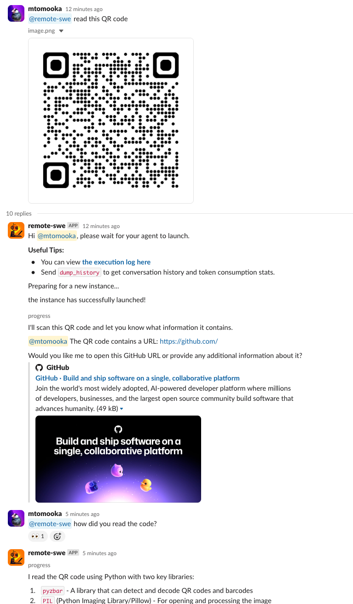

# Remote SWE Agents

これは完全に自律型のソフトウェア開発AIエージェントの実装例です。エージェントは専用の開発環境で動作するため、ノートパソコンに縛られることなく作業ができます！


## 主な特徴

* **完全自律型のソフトウェア開発エージェント** - AI駆動の開発ワークフロー自動化
* **Webベースの管理インターフェース** - セッション管理とリアルタイムモニタリング用のモダンなNext.js webapp
* **包括的なAPI** - プログラマティック統合とセッション制御のためのRESTful エンドポイント
* **AWS サーバーレスサービスによる最小限のメンテナンスコスト**
* **システムを使用しない間は前払いや固定費用なし**
* **MCP サポート** - MCPサーバーとの統合により
* **プロンプトキャッシュとミドルアウト戦略による効率的なトークン使用**
* **お好みの形式から知識を読み込み**（.clinerules、CLAUDE.md など）
* **OSS フォークリポジトリでも動作可能**

## 例

Remote SWE エージェントによるセッション例：

| 例1 | 例2 | 例3 | 例4 |
|:--------:|:--------:|:--------:|:--------:|
|  |  |  |  |
| GitHub issueによる指示。[結果のPR](https://github.com/aws-samples/remote-swe-agents/pull/17) | 単一の指示で複数のリポジトリに対応 [PR#1](https://github.com/aws-samples/trpc-nextjs-ssr-prisma-lambda/pull/16)、[PR#2](https://github.com/aws-samples/prisma-lambda-cdk/pull/37)、[PR#3](https://github.com/aws-samples/distributed-load-testing-with-locust-on-ecs/pull/25) | エージェントは画像の入出力も可能。 | エージェントは英語以外の言語も話せます。[結果のPR](https://github.com/tmokmss/deploy-time-build/pull/32) |

### Remote SWE Agentsによって作成されたプルリクエスト

エージェントによって作成された公開プルリクエストはすべて[こちら](https://github.com/search?q=is%3Apr+author%3Aremote-swe-user&type=pullrequests)で確認できます。このGitHubユーザーからプッシュされたすべてのコミットは、エージェントによって自律的に作成されています。

## インストール手順

このプロジェクトはニーズに応じて2つのインストールパターンをサポートしています。要件に最も適したパターンを選択してください：

- **パターンA（Webインターフェースのみ）**：webappアクセスのみのクイックセットアップ
- **パターンB（Web + Slack統合）**：webappとSlackボット機能の両方を含む完全セットアップ

### 前提条件

- Node.js（バージョン22以上）
- npm（バージョン9以上）
- AWS CLI
- 適切な権限を持つAWS IAMプロファイル
- Docker
- Bedrock Claude Sonnet 3.7モデルが[us-west-2リージョンで有効化](https://docs.aws.amazon.com/bedrock/latest/userguide/getting-started.html#getting-started-model-access)されていること
- GitHubアカウント
- Slackワークスペース（パターンBのみ）

---

## パターンA：Webインターフェースのみのセットアップ

このパターンは、WebインターフェースとAPIエンドポイントのみを通じてシステムにアクセスを提供します。Slack統合が不要なユーザーに最適です。

### ステップ1：リポジトリのクローン

```bash
git clone https://github.com/aws-samples/remote-swe-agents.git
cd remote-swe-agents
```

### ステップ2：SSMパラメータの作成

GitHub統合のセットアップを行う前に、CDKから参照されるプレースホルダーのSSMパラメータを作成します：

```bash
aws ssm put-parameter \
    --name /remote-swe/slack/bot-token \
    --value "placeholder" \
    --type String

aws ssm put-parameter \
    --name /remote-swe/slack/signing-secret \
    --value "placeholder" \
    --type String

aws ssm put-parameter \
    --name /remote-swe/github/personal-access-token \
    --value "placeholder" \
    --type String
```

### ステップ3：GitHub統合のセットアップ

GitHubと連携するには、GitHub統合のセットアップが必要です。GitHub統合には2つの選択肢があります：

**どちらのオプションを選ぶべきか？**
- **Personal Access Token（オプション3A）**：個人利用や迅速なセットアップに適しています。より単純ですが、単一のユーザーアカウントに紐づけられます。
- **GitHub App（オプション3B）**：チーム環境や組織での利用に推奨されます。より詳細な権限を提供し、個人アカウントに紐づけられません。

#### オプション3A：Personal Access Token (PAT)

1. [GitHub設定 > 開発者設定 > 個人アクセストークン](https://github.com/settings/tokens)にアクセス
2. 適切なリポジトリアクセス権を持つ新しいトークン（クラシック）を生成
   * 必要なスコープ：`repo, workflow, read:org`
   * 許可するスコープが多いほど、エージェントがさまざまなタスクを実行できるようになります
3. 生成したトークン文字列でSSMパラメータを更新：
   ```bash
   aws ssm put-parameter \
      --name /remote-swe/github/personal-access-token \
      --value "your-access-token" \
      --type String \
      --overwrite
   ```

> [!NOTE]
> システムを複数の開発者と共有したい場合、個人の権限の悪用を防ぐために、自分のアカウントのPATを使用するのではなく、[GitHubのマシンユーザーアカウント](https://docs.github.com/en/get-started/learning-about-github/types-of-github-accounts#user-accounts)を作成することをお勧めします。

#### オプション3B：GitHub App

1. [GitHub設定 > 開発者設定 > GitHub Apps](https://github.com/settings/apps)にアクセス
2. 新しいGitHub Appを作成
3. 権限を設定し、秘密鍵を生成
   - 必要な権限：Actions(RW)、Issues(RW)、Pull requests(RW)、Contents(RW)
4. 秘密鍵用の[AWS Systems Manager パラメータストア](https://console.aws.amazon.com/systems-manager/parameters)のパラメータを作成
   - このパラメータはCDKから参照されます（デフォルトのパラメータ名：`/remote-swe/github/app-private-key`）
   ```bash
   aws ssm put-parameter \
      --name /remote-swe/github/app-private-key \
      --value "$(cat your-private-key.pem)" \
      --type String
   ```
5. 使用したいGitHub組織にアプリをインストール
   - アプリをインストールした後、URL（`https://github.com/organizations/<YOUR_ORG>/settings/installations/<INSTALLATION_ID>`）からインストールIDを確認できます
6. 以下の値をメモしておいてください：
   - アプリID（例：12345678）
   - インストールID（例：12345678）
   - AWS Systems Manager パラメータストア内の秘密鍵パラメータ名

> [!NOTE]
> 現在、GitHub Appを使用する場合、単一の組織（つまり、アプリのインストール）の下のリポジトリのみを使用できます。

### ステップ4：環境変数のセットアップ

まずサンプルテンプレートから `.env.local` ファイルを作成してください:

```bash
cp .env.local.example .env.local
```

次に、`.env.local` を編集してデプロイメントに必要な環境変数を設定します。

#### GitHub App統合

GitHub App統合（上記のオプション3B）を使用する場合、`.env.local` ファイルに以下の変数を設定します：

```sh
GITHUB_APP_ID=your-github-app-id
GITHUB_INSTALLATION_ID=your-github-installation-id
```

#### ワーカーインスタンス設定

ワーカーインスタンスロールにアタッチする追加のマネージドポリシーを設定するには、`.env.local` ファイルに以下を記述します。AWSマネージドポリシーの名前とARN形式の両方を設定できます:

```sh
WORKER_ADDITIONAL_POLICIES=AmazonS3ReadOnlyAccess,arn:aws:iam::123456789012:policy/CustomPolicy
```

#### 既存VPCの使用

新しいVPCを作成する代わりに既存のVPCを使用する場合は、`.env.local` ファイルに以下を記述してVPC IDを指定できます：

```sh
VPC_ID=vpc-12345abcdef
```

この環境変数が設定されている場合、デプロイは新しいVPCを作成せずに指定された既存のVPCを使用します。

#### Webappユーザー作成

デプロイ中に初期webappユーザーを自動作成するには、`.env.local` ファイルに以下を記述します：

```sh
INITIAL_WEBAPP_USER_EMAIL=your-email@example.com
```

この変数が設定されている場合、デプロイ中にCognitoユーザーが作成され、指定されたメールアドレスに一時パスワードが送信されます。このメールと一時パスワードを使用してwebappにログインできます。

この変数を設定しない場合は、後でAWS Cognitoマネジメントコンソールを通じて手動でユーザーを作成できます。[AWS管理コンソールでの新しいユーザーの作成](https://docs.aws.amazon.com/cognito/latest/developerguide/how-to-create-user-accounts.html#creating-a-new-user-using-the-console)を参照してください。

> [!NOTE]
> ここでは、GitHub Actions変数から設定を注入するために環境変数を使用しています。これが便利でない場合は、[`bin/cdk.ts`](cdk/bin/cdk.ts)内の値を直接ハードコードすることもできます。

### ステップ5：CDKのデプロイ

```bash
cd cdk && npm ci
npx cdk bootstrap
npx cdk deploy --all
```

デプロイには通常約10分かかります。

**以上です！** デプロイ後、CDKスタック出力に表示される`WebappUrl`を通じてシステムにアクセスできます。

## パターンB：Web + Slack統合のセットアップ

このパターンは、パターンAのすべてにSlackボット機能を追加したものです。

### ステップ1-5：まずパターンAのセットアップを完了

上記のパターンAのすべてのステップに従って、基本システムを動作させます。

### ステップ6：Slackアプリのセットアップ

ここでは、Slackインターフェースを通じてエージェントを制御するためのSlackアプリを設定する必要があります。

#### Slackアプリの作成

1. [Slack Appsダッシュボード](https://api.slack.com/apps)にアクセス
2. 「Create New App」（新しいアプリを作成）をクリック
3. 「From manifest」（マニフェストから）を選択
4. 提供されているSlackアプリのマニフェストYAMLファイルを使用：[manifest.json](./resources/slack-app-manifest.json)
   - Slackワークスペース管理者がより広い権限をボットに付与することを許可している場合は、[slack-app-manifest-relaxed.json](./resources/slack-app-manifest-relaxed.json)も利用できます。これを使うと、botにメンションをしなくても、Slackスレッド内でエージェントと会話することができます。
   - エンドポイントURL（`https://redacted.execute-api.us-east-1.amazonaws.com`）を実際のURLに置き換えてください
   - 実際のURLはCDKデプロイメント出力の`SlackBoltEndpointUrl`で確認できます
5. 以下の値を必ずメモしておいてください：
   - 署名シークレット（Basic Informationで確認可能）
   - ボットトークン（OAuth & Permissions内、ワークスペースにインストール後に確認可能）

詳細については、こちらのドキュメントを参照してください：[マニフェストでアプリを作成および設定する](https://api.slack.com/reference/manifests)

> [!NOTE]
> 共有（個人ではなく）Slackワークスペースを使用している場合は、エージェントへのアクセスを制御するために`SLACK_ADMIN_USER_ID_LIST`環境変数（以下を参照）の設定を検討してください。この制限がないと、ワークスペース内の誰でもエージェントにアクセスでき、潜在的にあなたのGitHubコンテンツにもアクセスできてしまいます。

#### Slack用SSMパラメータの更新

Slackアプリを作成した後、以下のコマンドでAWSアカウントにシークレットを登録します：

```bash
aws ssm put-parameter \
    --name /remote-swe/slack/bot-token \
    --value "your-slack-bot-token" \
    --type String \
    --overwrite

aws ssm put-parameter \
    --name /remote-swe/slack/signing-secret \
    --value "your-slack-signing-secret" \
    --type String \
    --overwrite
```

`your-slack-bot-token`と`your-slack-signing-secret`を、前のステップで取得した実際の値に置き換えてください。これらのパラメータはCDKから参照されます。

### ステップ7：（オプション）Slackからのシステムアクセス制限

Slackワークスペース内のどのメンバーがエージェントにアクセスできるかを制御するには、`.env.local` ファイルにSlackユーザーIDのカンマ区切りリストを記述します：

メンバーのSlackユーザーIDを取得するには、[これらの指示](https://www.google.com/search?q=copy+member+id+slack)に従ってください。

```sh
SLACK_ADMIN_USER_ID_LIST=U123ABC456,U789XYZ012
```

指定されたユーザーID以外のすべてのユーザーは、Slackアプリへのアクセスを試みると「Unauthorized」エラーを受け取ります。

> [!NOTE]
> ユーザーにアプリへのアクセス権を付与するには、`approve_user`メッセージとユーザーのメンションをアプリでメンションします。例：`@remote-swe approve_user @Alice @Bob @Carol`

### ステップ8：Slack統合でCDKを再デプロイ

上記のセットアップが完了したら、`cdk deploy`を再度実行します。

```bash
cd cdk
npx cdk deploy --all
```

**完了です！** これでWebインターフェースとSlackボット機能の両方にアクセスできます。

---

## デプロイしたシステムへのアクセス

デプロイが成功した後、以下の方法でRemote SWE Agentsシステムにアクセスできます：

1. **Webインターフェース**：CDKスタック出力の webapp URL にアクセス（出力で`WebappUrl`を探してください）
   - セッション管理用のモダンなWebダッシュボードにアクセス
   - エージェントセッションをリアルタイムで作成・監視
   - コスト分析とシステム使用状況の確認
   - 画像のアップロードと設定管理

2. **Slackインターフェース**：Slackアプリをメンションするだけで、エージェントにタスクを割り当て開始
   - Slackワークスペースとの直接統合
   - エージェントとのスレッドベースの会話
   - リアルタイムの進捗更新

3. **APIアクセス**：プログラマティック統合用のRESTful APIエンドポイントを使用
   - セッションの作成と管理
   - 自動化されたワークフローとCI/CD統合
   - カスタムアプリケーションの開発

4. **GitHub Actions統合**：GitHub Actionsを使用してリポジトリと統合
   - GitHub イベントからエージェントを自動的にトリガー
   - issue コメントやアサインメントに対応
   - シームレスなCI/CD統合

エージェントを効果的に使用するためのヒントについては、以下の「有用なヒント」セクションを参照してください。

### GitHub Actions統合

このリポジトリはGitHub Actionとして使用でき、issueコメント、アサイン、PRレビューなどのGitHubイベントから自動的にRemote SWEエージェントをトリガーできます。GitHub ActionはRemote SWE API機能を使用してエージェントセッションを作成・管理します。

ワークフローで`aws-samples/remote-swe-agents`を使用し、APIベースURLとキーをリポジトリシークレットとして設定してください。APIキーはデプロイされたwebappインターフェースから生成できます。入力パラメータについては[action.yml](./action.yml)を、完全なワークフロー例については[.github/workflows/remote-swe.yml](./.github/workflows/remote-swe.yml)を参照してください。

### テナント分離モデル

このプロジェクトは現在、シングルテナントシステムとして設計されており、テナントごとにデプロイすることを想定しています。

完全従量課金制モデルに従っているため、複数のインスタンスをデプロイするオーバーヘッドは、インフラストラクチャコストの観点では最小限です。

各テナントのアクセスを制御するために、以下のアクセス許可設定があります：

1. **Slackアプリ**：CDKで`SLACK_ADMIN_USER_ID_LIST`環境変数を設定して、許可されていないユーザーからのアクセスを拒否できます。その後、`approve_user` Slackコマンドを使用して許可されたユーザーを追加できます。
2. **Webapp**：Cognitoのセルフサインアップはデフォルトで無効になっています。Cognito管理コンソールからユーザーを追加できます。現在、Cognitoアカウントを持つ人は誰でも同等の権限を持ちます。ユーザーはWeb UIからシステムの設定、新しいセッションの作成、APIキーの発行、またはコスト分析の確認ができます。さらに、AWS WAFを使用してIPアドレス制限を適用し、Webインターフェースへのアクセスをさらに制限することもできます。
3. **REST API**：APIキーを知っている人は誰でもアクセスできます。使用されなくなったキーは削除する必要があります。追加のセキュリティとして、AWS WAFを使用してIPアドレス制限を実装することもできますが、これによりGitHub Actionsなどのパブリックランナーを使用するCI/CD環境からAPIを利用する能力が制限される可能性があることに注意してください（これらは動的IPアドレスを使用するため）。
4. **GitHub Actions**：リポジトリへの書き込みアクセス権を持つ人（つまり、コラボレーター）は誰でもアクションを呼び出すことができます。

## 有用なヒント

### プロンプトのベストプラクティス

エージェントを起動するとき、指示には少なくとも以下の内容を含めるべきです：

1. エージェントが見るべきGitHubリポジトリ
2. 解決したい機能またはバグの説明
3. 最初にチェックすべきファイル（ファイルパスが最適ですが、キーワードのみでも機能します）

ワークフローを簡素化するために、上記の情報を含むGitHub issueをリポジトリに作成し、エージェントにそのURLを渡すことができます。
この方法では、リポジトリはURLから自動的に推測され、新しいPRを対応するissueにリンクすることもできます。

### MCPサーバーとの統合

エージェントはMCPクライアントとして機能できるため、さまざまなMCPサーバーと簡単に統合できます。統合を設定するには、[`mcp.json`](./packages/worker/mcp.json)を編集してCDK deployを実行します。例えば、

```json
  "mcpServers": {
    "awslabs.cdk-mcp-server": {
      "command": "uvx",
      "args": ["awslabs.cdk-mcp-server@latest"],
      "env": {
        "FASTMCP_LOG_LEVEL": "ERROR"
      }
    }
  }
```

これにより、すべての新しいエージェントがMCPサーバーをツールとして使用できるようになります。

### 基盤モデルのオーバーライド

デフォルトでは、Remote SWEは基盤モデルとしてClaude Sonnet 3.7を使用しています。この設定は環境変数を使用して上書きできます：

```bash
WORKER_MODEL_OVERRIDE=nova-pro npx cdk deploy
```

利用可能なモデル値は次のとおりです：`sonnet3.5v1, sonnet3.5, sonnet3.7, haiku3.5, nova-pro, opus4, sonnet4`

デプロイ後、新しいワーカーはオーバーライドされたモデルを使用します。

この機能は非常に実験的であり、最適な体験のために通常はデフォルトモデルを使用することをお勧めします。

## 仕組み

このシステムはSlack Boltアプリケーションを利用して、ユーザー操作を管理し、スケーラブルなワーカーシステムを実装しています。以下が主なワークフローです：

1. **メッセージの受信と処理**
   - ユーザーがSlackでメッセージを送信すると、それはwebhookを介してSlack Boltアプリケーションに転送されます
   - API Gatewayがwebhook要求を受け取り、Lambda関数に渡します

2. **イベント管理とメッセージ配信**
   - Lambda関数はユーザーメッセージをAppSync Eventsに発行します
   - メッセージ履歴は後続の処理で参照するためDynamoDBに保存されます

3. **ワーカーシステム管理**
   - 新しいSlackスレッドが作成されると、ワーカーマネージャーに通知されます
   - ワーカーマネージャーはEC2インスタンスとEBSボリュームで構成されるワーカーユニットをプロビジョニングします
   - 各ワーカーユニットには実際の処理を担当するSWEエージェントが含まれています

4. **フィードバックループ**
   - ワーカーユニットはAppSync Eventsを購読してユーザーメッセージを受信します
   - 処理結果と進捗状況の更新は、ユーザーへの返信としてSlackに送信されます
   - ジョブステータスはDynamoDBで管理されます

このアーキテクチャにより、スケーラブルで信頼性の高いメッセージ処理システムが実現されます。サーバーレスコンポーネント（Lambda、API Gateway）とワーカーごとの専用EC2インスタンスの組み合わせにより、リソースの分離と柔軟なスケーラビリティが確保されます。


### AIエージェントのセキュリティベストプラクティス

AIエージェントは強力な機能を提供しますが、同時に潜在的なセキュリティリスクももたらします。以下は、これらのリスクを軽減するための推奨プラクティスです：

1. **実行環境の分離**
   - エージェントは専用のVM上で動作し、潜在的なファイルシステムへの損害をその環境のみに限定
   - エージェントがローカルファイルシステムを操作するような誤動作があっても、ユーザーのシステムには影響しない

2. **最小権限の原則**
   - デフォルトでは、ワーカーインスタンスには最小限のIAMポリシーのみが割り当てられている（ログ記録、自己終了、S3読み取りアクセスなど）
   - `WORKER_ADDITIONAL_POLICIES`環境変数で権限を追加する場合は、エージェントの意図しない動作に関連するリスクを慎重に評価すること
   - 権限の影響範囲を考慮し、絶対に必要なものだけに制限する

3. **トークンセキュリティ管理**
   - エージェントは設定されたSlackボットトークンやGitHubアクセストークンにアクセスできる
   - これらのトークンを設定する際は、最小アクセス権限の原則に従うこと
   - GitHubの場合、専用のマシンユーザーやスコープ付き権限を持つGitHub Appの使用を検討すること
   - Slackの場合、デフォルト設定（slack-app-manifest.json）では最小限のスコープが使用されている；これらの権限を拡張する場合は注意が必要

4. **ネットワークアクセス制御**
   - AIエージェントは`curl`や`fetch`ユーティリティなどのツールを使用して、意図しないアウトバウンドアクセスを試みる可能性がある
   - このリスクを軽減するには、プロキシサーバーやファイアウォールを通じてアウトバウンドトラフィックをフィルタリングするVPCでデプロイすること
   - 適切なセキュリティ制御を持つ既存のVPCをインポートするには、`VPC_ID`環境変数を使用する
   - エージェントが通信できる外部サービスを制限するために、出力フィルタリングの実装を検討すること

これらのセキュリティプラクティスを実装することで、自律型AIエージェントのメリットを活用しながら、リスクを大幅に軽減できます。

## コスト

以下の表は、us-east-1（バージニア北部）リージョンで1ヶ月間このシステムをデプロイするためのサンプルコスト内訳です。

ここでは、月に100セッションをリクエストすると仮定しています。月額コストはセッション数に比例します（例：月に20セッションしか実行しない場合は、20/100を掛けます）。

| AWSサービス | ディメンション | コスト [USD/月] |
|-------------|------------|------------------|
| EC2 | t3.large、1時間/セッション | 8.32 |
| EBS | 50 GB/インスタンス、1日/インスタンス | 8.00 |
| DynamoDB | 読み取り: 1000 RRU/セッション | 0.0125 |
| DynamoDB | 書き込み: 200 WRU/セッション | 0.0125 |
| DynamoDB | ストレージ: 2 MB/セッション | 0.05 |
| AppSync Events | リクエスト: 20イベント/セッション | 0.002 |
| AppSync Events | 接続: 1時間/セッション | 0.00048 |
| Lambda | リクエスト: 30呼び出し/セッション | 0.0006 |
| Lambda | 期間: 128MB、1秒/呼び出し | 0.00017 |
| API Gateway | リクエスト: 20リクエスト/セッション | 0.002 |
| Bedrock | 入力（キャッシュ書き込み）: Sonnet 3.7 100kトークン/セッション | 37.5 |
| Bedrock | 入力（キャッシュ読み取り）: Sonnet 3.7 1Mトークン/セッション | 30.00 |
| Bedrock | 出力: Sonnet 3.7 20kトークン/セッション | 30.00 |
| 合計 | | 115 |

さらに、システムが使用されていない場合（つまり、エージェントにメッセージが送信されていない場合）、継続的なコストは最小限（〜0 USD）です。

## クリーンアップ
以下のコマンドで作成したすべてのリソースをクリーンアップできます：

```sh
npx cdk destroy --force
```

> [!NOTE]  
> `cdk deploy` 実行時に非同期でEC2 Image Builderパイプラインが起動します。デプロイ後、スタックを削除する前に少なくとも30分お待ちください。スタックの削除に失敗した場合は、約30分待ってから `cdk destroy` を再実行してください。

## セキュリティ

詳細については、[CONTRIBUTING](CONTRIBUTING.md#security-issue-notifications)を参照してください。

## ライセンス

このライブラリはMIT-0ライセンスでライセンスされています。LICENSEファイルを参照してください。
